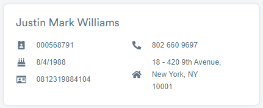

# Integrate Your Web Application with EmbedID
Trulioo's GlobalGateway EmbedID allows you to add identity verification and fraud detection to your web application. 

This tutorial shows you the steps to integrate your web application with Trulioo GlobalGateway EmbedID for identity verification on your localhost. This tutorial is intended for people who are familiar with node.js, HTML, REST API, web services, and comfortable running commands in a command-line interface.

**Tools you need**:

- Any code or text editor
- [node.js](https://nodejs.org/en/)
- [Postman](https://www.postman.com/)

## Step 1: Install the `trulioo-middleware` SDK
Trulioo has built several SDKs to assist you in your integration. 

1. In the command line, run the following to install the `trulioo-embedid-middleware` SDK:
   ```
   npm install trulioo-embedid-middleware
   ```
2. The `trulioo-middleware` SDK is an `express` middleware, so you also need to install `express`:
   ```
   npm install express
   ```

## Step 2: Create an identity verification experience
To set up an identity verification, you must first create an EmbedID identity verification experience through the [Trulioo developer portal](https://gateway-admin.trulioo.com/dashboard), which gives you an API key that you can use on your web service back-end and a public key that you can use on your web service front-end.

1. Create a free [Trulioo account](https://gateway-admin.trulioo.com/login/signup) if you haven't done so.
1. Log into the [Trulioo developer portal](https://gateway-admin.trulioo.com/dashboard).
2. Click **EmbedID** in the left sidebar.
3. Click **Create New Experience**.
4. Give it a name, such as "HelloWorld".
5. Select **Identity Verification**.
6. Click **Create** to create a "HelloWorld" identity verification experience.

## Step 3: Customize your identity verification experience
Your identity verification experience is created. This generates a user verification form that you can include in your web application. You can customize and try out the verification form before your integration.

1. Go to the [Trulioo developer portal](https://gateway-admin.trulioo.com/dashboard).
2. Click **EmbedID** in the left sidebar.
3. Find the “HelloWorld” experience and click the Edit icon.
4. To customize the form, use the controls in the left sidebar.
5. To try out the form, click **Save and Preview Experience** and select a test entry.

<video width="960" height="720" controls autoplay>
  <source src="customize.mp4" type="video/mp4">
</video>

## Step 4: Start your back-end service
Create your web service and start it with node.js.

1. Open a text editor and create a file named `backend.js`.
2. Copy and paste the following to the `backend.js` file:
   ```
   const truliooMiddleware = require('trulioo-embedid-middleware')({ 
   apiKey: '<TRULIOO_API_KEY>' }); 
   const express = require('express'); 
   const app = express(); 
   const port = 8080;

   app.use(truliooMiddleware) 
   app.listen(port, () => console.log('Example app listening on port 8080!'));
   ```
3. Go back to the [Trulioo developer portal](https://gateway-admin.trulioo.com/dashboard) and click **EmbedID** in the left sidebar.
3. Find the “HelloWorld” experience and click the Edit icon.
4. In the left sidebar, click to expand the **Keys** section.
4. Locate the API Key (BE) field and copy your API Key.
5. In the `backend.js` file, replace `<TRULIOO_API_KEY>` with your API key.
6. Save your `backend.js` file to the desired location.
7. In the command line, go to the location where your `backend.js` file is saved.
8. Run the following to start your server:
   ```
   node backend.js
   ```
   If you see the "Example app listening on port 8080!" message, you have successfully set up your server!
   
## Step 5: Set up your front-end HTML
1. Open a text editor and create a file named `index.html`.
2. Copy and paste the following code to the `index.html` file:
   ```
   <div id="trulioo-embedid"></div>

   <!-- This script renders the form for the div above --> 
   <script type="text/javascript" src="https://js.trulioo.com/latest/main.js"></script>

   <!-- Initialize your form here with your Frontend (FE) key -->
   <script> 
     // Handle the response of EmbedID after form submits
     function handleResponse(e) { 
       console.log('handleResponse', e); 
     } 

     const publicKey = 'Trial Key (FE)_OR_Live Key (FE)'; // Public Key
     // const accessTokenURL = 'http://localhost:8080/trulioo-api/embedids/tokens';
     new TruliooClient({ 
       publicKey, 
       // accessTokenURL,
       handleResponse 
     });
   </script>
   ```
3. Go back to your "HelloWorld" identity verification experience and click the edit icon.
4. In the left sidebar, click to expand the **Keys** section.
4. Locate the Trial Key (FE) field and copy your Trial Key.
5. In the `index.html` file, replace `Trial Key (FE)_OR_Live Key (FE)` with your Trial key.

## Step 6: Make a request with a test entity
1. Open `index.html` in your browser.
   Your “HelloWorld” identity verification form appears.
3. Enter the following information in the form:

   
   
4. Click **Submit**.

## Step 7: Get the verification response
1. Open Postman and create a GET request:
   ```
   GET  https://gateway.trulioo.com/experienceTransaction/{experienceTransactionId}
   ```
1. Go back to the [Trulioo developer portal](https://gateway-admin.trulioo.com/dashboard) and click **Transaction**.
2. From the **Transaction History**, find the transaction that you just made and copy the transaction ID. 
3. Replace `{experienceTransactionId}` with your transaction ID in your Postman request.
4. Go back to your dashboard and copy your `x-trulioo-api-key`.
4. In your Postman request, click the Header tab and add a key `x-trulioo-api-key` with your api-key value.
5. Click Send.

   The response body shows the verification response:
   
   <video width="960" height="720" controls autoplay>
     <source src="verify.mp4" type="video/mp4">
   </video>
